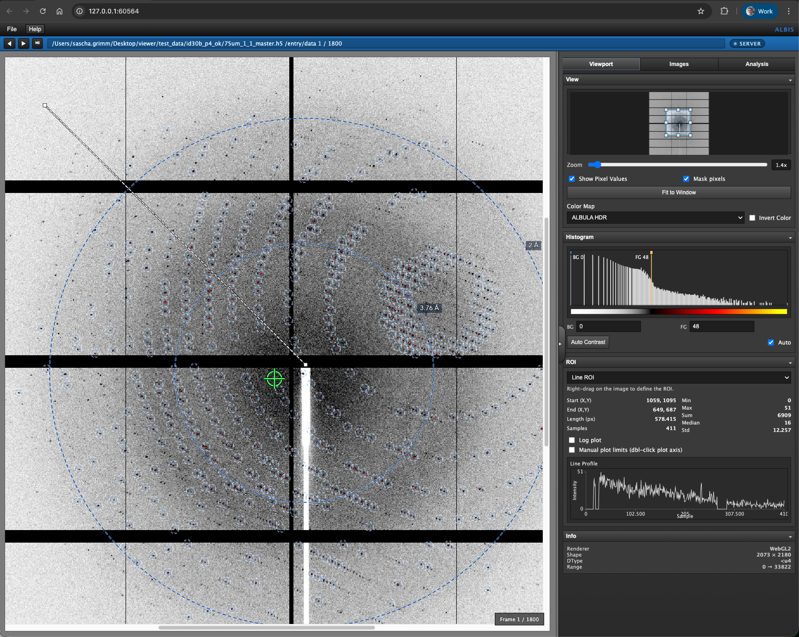

# ALBIS (ALBIS WEB VIEW)

ALBIS is an **ALBULA‑style**, browser‑based image viewer for diffraction data and large HDF5 stacks. It is platform‑independent, free, and open source.

It targets modern **DECTRIS** detectors (SELUN, EIGER2, PILATUS4) and supports **filewriter1** and **filewriter2** layouts, including multi‑threshold (multi‑channel) data.

Image sources can be:
- Files on disk (`.h5/.hdf5` stacks) and common detector image formats (`.tif/.tiff`, `.cbf/.cbf.gz`, `.edf`).
- The detector **SIMPLON monitor** stream for live viewing.
- The **Remote Stream API** (`/api/remote/v1/*`) for externally pushed frames + metadata.

ALBIS includes quick statistics tools, an HDF5 dataset inspector, and many small workflow optimizations.

Project note: this is a private vibe‑coding project for fun and educational purposes.

- Contributions welcome: see `CONTRIBUTING.md`.
- Security: see `SECURITY.md`.
- Developer architecture docs: `docs/ARCHITECTURE.md` and `docs/CODE_MAP.md`.

Community workflow files:
- Issue forms: `.github/ISSUE_TEMPLATE/`
- PR template: `.github/PULL_REQUEST_TEMPLATE.md`
- Code owners: `CODEOWNERS`



## Highlights

- ALBULA‑style UI with fast navigation and contrast control.
- Full support for DECTRIS filewriter1 and filewriter2 (multi‑threshold data with selector).
- Live SIMPLON monitor mode with mask prefetch.
- Remote Stream mode for live external producers (with optional ring parameters and colored peak overlays).
- ROI tools (line, box, circle, annulus) with statistics and plots.
- Pixel mask support (gaps and defective pixels).
- WebGL2 rendering with CPU fallback.
- spotfinding & resolution rings overlay

## Run (backend + frontend)

```bash
python -m venv .venv
. .venv/bin/activate
pip install -r backend/requirements.txt
python backend/app.py
```

Open `http://localhost:8000` (ALBIS).

## Run Modes

- Python/source mode:
  Run directly from this repository with `python backend/app.py` (or `python albis_launcher.py`).
- Standalone mode:
  Use packaged artifacts created by the build scripts (no Python installation required on target machines).

## Developer Quality Gates

Install dev tooling:

```bash
pip install -r requirements-dev.txt
npm ci
```

Run local checks:

```bash
ruff check backend tests scripts test_scripts
black --check tests scripts test_scripts
PYTEST_DISABLE_PLUGIN_AUTOLOAD=1 pytest
npm run lint:js
```

Optional pre-commit hooks:

```bash
pre-commit install
pre-commit run --all-files
```

CI runs on GitHub Actions across Linux/macOS/Windows (Python 3.10) plus frontend lint.

## Remote Stream API

ALBIS can ingest externally generated frames and metadata when Data Source is set to `Remote Stream`.

### Endpoints

- `POST /api/remote/v1/frame`
  - Query:
    - `source_id` (optional, default `default`)
    - `seq` (optional sequence number)
  - Multipart fields:
    - `image` (required): raw frame bytes or encoded image bytes
    - `meta` (optional): JSON string
- `GET /api/remote/v1/latest`
  - Query:
    - `source_id`
    - `after_seq` (optional; returns `204` if no new frame)
  - Returns frame bytes and `X-Remote-*` headers
- `GET /api/remote/v1/meta`
  - Query:
    - `source_id`
    - `seq` (optional)
  - Returns parsed metadata including `peak_sets`

### Supported `meta` keys

- Decode settings:
  - `format`: `raw`, `tiff`, `cbf`, `cbf.gz`, `edf`
  - `dtype` and `shape` (required for `raw`)
- Display:
  - `display_name`, `series_number`, `image_number`, `image_datetime`
- Resolution ring parameters:
  - `distance_mm`, `pixel_size_um`, `energy_ev`, `wavelength_a`
  - `beam_center_x`, `beam_center_y` or `resolution.beam_center_px: [x, y]`
- Overlay peak lists:
  - `peak_sets`: list of `{name, color, points}` where points are `[x, y]` or `[x, y, intensity]`

### Minimal sender example

```python
import json
import requests
import numpy as np

PORT = 8080
SOURCE_ID = "default"

frame = (np.random.rand(512, 512) * 1000).astype("<u2")
meta = {
    "format": "raw",
    "dtype": "<u2",
    "shape": [512, 512],
    "display_name": "Remote demo frame",
    "series_number": 1,
    "image_number": 42,
    "resolution": {
        "distance_mm": 150.0,
        "pixel_size_um": 75.0,
        "energy_ev": 12000.0,
        "beam_center_px": [256, 256]
    },
    "peak_sets": [
        {"name": "predicted", "color": "#00ff88", "points": [[240, 250], [270, 265]]}
    ]
}

requests.post(
    f"http://127.0.0.1:{PORT}/api/remote/v1/frame?source_id={SOURCE_ID}",
    data={"meta": json.dumps(meta)},
    files={"image": ("frame.raw", frame.tobytes(), "application/octet-stream")},
    timeout=5,
).raise_for_status()
```

### Quick local smoke test

`test_scripts/stream_ingest.py` posts one synthetic frame to the backend:

```bash
python test_scripts/stream_ingest.py
```

Important: the script `source_id` must match the UI `Remote Stream` source id (default `default`).

## Architecture

ALBIS uses a server-client architecture:

- Backend server (FastAPI + Python):
  Loads detector/image data, handles monitor streams, computes metadata/analysis, and exposes REST endpoints.
- Frontend client (browser UI):
  Runs in the browser, renders images/overlays, and interacts with the backend over HTTP.
- Local deployment model:
  The backend typically runs on the same machine as the user, and the UI connects to `http://localhost:<port>`.

Detailed implementation notes:

- System architecture and data flows: `docs/ARCHITECTURE.md`
- Backend/frontend code navigation map: `docs/CODE_MAP.md`

## Configuration (`albis.config.json`)

ALBIS runtime settings are configured via `albis.config.json` (project root by default).

Example:

```json
{
  "server": {
    "host": "0.0.0.0",
    "port": 8000,
    "reload": false
  },
  "data": {
    "root": "/path/to/data",
    "allow_abs_paths": true,
    "scan_cache_sec": 2.0,
    "max_scan_depth": 3,
    "max_upload_mb": 0
  },
  "logging": {
    "level": "INFO",
    "dir": ""
  },
  "launcher": {
    "port": 0,
    "startup_timeout_sec": 5.0,
    "open_browser": true
  }
}
```

Notes:
- `data.root = ""` defaults to project root for source runs and `~/ALBIS-data` for packaged runs.
- `server.host = "0.0.0.0"` enables LAN access (`http://<your-ip>:8000`).
- `logging.dir = ""` writes logs to `<data.root>/logs/albis.log`.
- Packaged installs auto-create a default user config at `~/.config/albis/config.json` on first run (if no config is found).

## Logging

Log level and log directory are configured in `albis.config.json` under `logging.level` and `logging.dir`.

Frontend warnings/errors are forwarded to the backend log via `/api/client-log`.

## Packaging (PyInstaller)

ALBIS can be bundled into a **platform‑native app** (no Python required) using PyInstaller.

### Build (macOS)

```bash
./scripts/build_mac.sh
```

This produces versioned artifacts in `dist/`, e.g.:
- `ALBIS-macos-<os_version>-v0.6.1-<commit>.zip`
- `ALBIS-macos-<os_version>-v0.6.1-<commit>.dmg`

`build_mac.sh` also attempts to create a macOS `.app` bundle with icon support (from `frontend/ressources/icon.png`).
DMG images include an `Applications` shortcut for drag-and-drop installation.

### Build (Linux)

```bash
./scripts/build_linux.sh
```

Example output:
- `ALBIS-linux-<distro_version>-v0.6.1-<commit>.tar.gz`

### Build (Windows)

```powershell
.\scripts\build_windows.ps1
```

Example output:
- `ALBIS-windows-<os_version>-v0.6.1-<commit>.zip`
- Inno Setup installer (via `.\scripts\package_windows_innosetup.ps1`):
  `ALBIS-Setup-windows-<os_version>-v0.6.1-<commit>.exe`

### Output

The unpacked app payload is created under `dist/ALBIS/` (and on macOS additionally `dist/ALBIS.app`).
Use `albis.config.json` to change data path, host/port, logging, and launcher behavior.

## Keyboard Shortcuts

- `⌘O` Open
- `⌘W` Close File
- `⌘S` Save As
- `⌘E` Export
- `F1` Documentation
- `Tab` Play/Pause
- `←`/`→` Previous/Next frame
- `↑`/`↓` Jump by Step setting (or threshold change when multi‑threshold is active)

## Roadmap — Next Milestones
- [x] v0.5 multi image support (h5, cbf, cbf.gz, tiff, edf)
- [x] v0.6 server-client remote stream API (frame + metadata ingest)
- [ ] v0.7 ~~detector control and status~~ will be an independent project - disentangle control and view. facelift moved to v 0.7
- [ ] v0.8 refactor, tests, documentation
- ...? =)

## Notes
- current focus of the development is server and client running on the same machine.
- there are likely many little bugs hidden - reports or fixes are welcome

## Acknowledgements and Contributions
This projects stand on the shoulder of a giant: ALBULA. Thanks a lot to Volker Pilipp for creating such an intuitive image viewer which set for many the benchmark.
