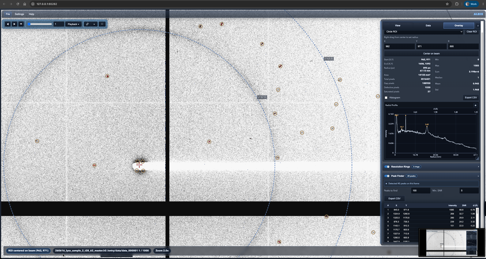

# ALBIS (**A**lbula-style, **B**rowser-based **I**mage viewer for **S**ynchrotron Images)

ALBIS is an **ALBULA‑style**, browser‑based image viewer for large HDF5 stacks and other common DECTRIS camera formats. It is platform‑independent, free, and open source.

It targets modern and not so modern **DECTRIS** detectors (SELUN, EIGER(2), PILATUS(4), MYTHEN(2), POLLUX, and JUNGFRAU — including rectangular "strixel" pixels) and supports **filewriter1** and **filewriter2** layouts, including multi‑threshold (multi‑channel) data.

Image sources can be:

- Files on disk (`.h5/.hdf5` stacks and common detector image formats `.tif/.tiff`, `.cbf/.cbf.gz`, `.edf`).
- **MYTHEN(2)** strip-detector acquisitions - open the acquisition's `.cfg` and the whole run is assembled into one image (channel across, frame down, counts as intensity).
- The detector **SIMPLON monitor** stream for live viewing.
- **JUNGFRAUJOCH Preview** ZeroMQ PUB stream (CBOR image messages + reflection spots).
- The **Remote Stream API** (`/api/remote/v1/*`) for externally pushed frames + metadata.

ALBIS includes quick statistics tools, an HDF5 dataset inspector, and many small workflow optimizations.

Official public support covers:

- **Windows x64**
- **macOS arm64 / x64**
- **Linux x64**

Docker images are published for **local and trusted lab deployments** on `linux/amd64` and `linux/arm64`.
Public internet exposure is **not** a supported deployment mode.

## Getting Started (just want to look at images?)

You don't need Python or any setup. Three steps:

1. **Download** the build for your operating system from the [Releases](https://github.com/SaschaAndresGrimm/ALBIS/releases) page (see [Downloads / Installation](#downloads--installation) below for which file to pick).
2. **Install and open it:**
   - **macOS:** open the `.dmg` and drag ALBIS into `Applications`, then launch it. The builds are signed and notarized, so they open normally.
   - **Windows:** run the `...-Setup-...exe` installer. If Windows shows a blue "Windows protected your PC" screen, click **More info → Run anyway** (this is expected for newer apps).
   - **Linux:** make the `.AppImage` executable (`chmod +x ALBIS-*.AppImage`) and double-click it, or run the bundled `install_linux_appimage.sh`.
3. **Open your first image:** use **File → Open** to load an HDF5 stack, TIFF, CBF or EDF file, or a MYTHEN acquisition's `.cfg`. Navigate frames with the slider or the `←`/`→` keys.

Press **F1** any time inside ALBIS to open the built-in help (interaction basics, keyboard shortcuts, data sources, and troubleshooting).

For the full walkthrough — opening data, contrast, ROI statistics, resolution rings, live sources, and exporting — see the **[User Guide](docs/USER_GUIDE.md)**.

## Highlights

- ALBULA‑style UI with fast navigation and contrast control.
- Built for remote use: server backend, browser frontend.
- Full support for DECTRIS filewriter1 and filewriter2 (multi‑threshold data with selector).
- Live SIMPLON monitor mode with mask prefetch.
- JUNGFRAUJOCH Preview mode (ZeroMQ CBOR stream bridge with reflection overlays).
- Remote Stream mode for live external producers (with optional ring parameters and colored peak overlays).
- MYTHEN(2) strip-detector acquisitions rendered as a single channel‑vs‑frame intensity map.
- ROI tools (line, box, circle, annulus) with statistics and plots.
- Pixel mask support (gaps and defective pixels).
- Spot finding and resolution ring overlays.
- Export to TIFF or CBF, and animated GIF export of a series.
- Interface available in 13 languages.

## Downloads / Installation

You can download ready-to-use standalone binaries for your operating system. No Python installation is required for these.
Public releases include signed desktop artifacts where the platform supports them, plus `SHA256SUMS.txt` for download verification.

Check the [Releases](https://github.com/SaschaAndresGrimm/ALBIS/releases) page for the latest packages:

- **macOS Apple Silicon (arm64)**: `ALBIS-macos-arm64-v<version>-<commit>.dmg` (installer) or `.zip` (portable).
- **macOS Intel (x64)**: `ALBIS-macos-x64-v<version>-<commit>.dmg` (installer) or `.zip` (portable).
- **Windows x64**: `ALBIS-Setup-windows-x64-v<version>-<commit>.exe` (installer) or `ALBIS-windows-x64-v<version>-<commit>.zip` (portable).
- **Linux x64**: `ALBIS-<version>-x86_64.AppImage`, `ALBIS-<version>-x86_64-appimage-bundle.tar.gz` (AppImage + install/uninstall scripts), and `ALBIS-linux-x64-v<version>-<commit>.tar.gz`.

macOS release binaries are supported on macOS 14+ on Apple Silicon and macOS 15+ on Intel Macs. Use the native `arm64` build on Apple Silicon and the native `x64` build on Intel Macs.
Windows release binaries are supported on Windows 10 x64 and Windows 11 x64. Windows 8.1 x64 may work but is not part of the supported/tested release matrix; Windows 7, Windows 8.0, 32-bit Windows, and Windows ARM are not supported.
Linux desktop release binaries are currently published for `x86_64` only. The AppImage and tarball are intended for newer `x86_64` distributions with `glibc 2.38+`; for broader Linux compatibility, use the published Docker images on `linux/amd64` or `linux/arm64`.

ALBIS also runs directly in Python, see the [Power User Guide](docs/POWER_USER_GUIDE.md)

## Keyboard Shortcuts

- `⌘O` / `Ctrl+O` Open File
- `⌘W` / `Ctrl+W` Close File
- `⌘S` / `Ctrl+S` Save As — Full Image (`⇧⌘S` Visible Area, `⌥⌘S` Viewer Window)
- `⇧⌘X` / `Shift+Ctrl+X` Convert Dataset
- `F1` Documentation
- `Tab` Play/Pause
- `←`/`→` Previous/Next frame
- `↑`/`↓` Jump by Step setting (or threshold change when multi‑threshold is active)

## Advanced Usage & Contributing

For power users looking to configure the server, use the advanced Stream API, or run ALBIS from source:

- [Power User Guide](docs/POWER_USER_GUIDE.md)

For developers looking to build, test, and contribute:

- [Developer Guide](docs/DEVELOPER_GUIDE.md)
- [Contributing](CONTRIBUTING.md)

## Acknowledgements and Contributions

This project stands on the shoulders of a giant: ALBULA. Thanks to Volker Pilipp for creating such an intuitive image viewer that set the benchmark.
Thanks to Tilman Donath and Nicolas Pilet for testing, breaking, and giving useful feedback for improvements.
