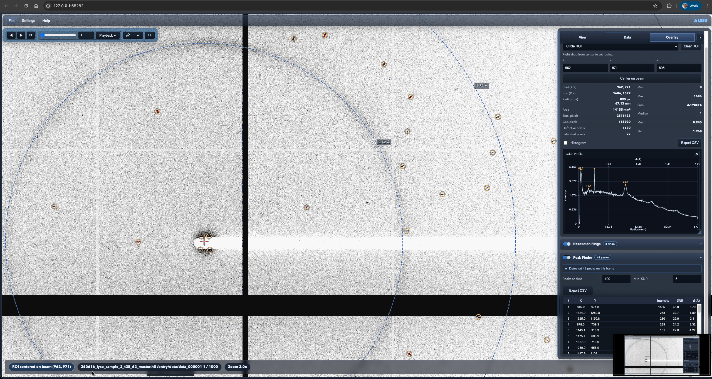

# ALBIS (**AL**BULA-style **B**rowser-based **I**mage viewer for **S**cientific detectors)

[](https://github.com/SaschaAndresGrimm/ALBIS/actions/workflows/ci.yml)
[](LICENSE)
[](https://github.com/SaschaAndresGrimm/ALBIS/releases)
[](https://doi.org/10.5281/zenodo.22046648)



ALBIS is a free, open-source viewer for **DECTRIS detector data**, in the style of ALBULA. It opens HDF5 stacks, TIFF, CBF, EDF and MYTHEN acquisitions, follows a running experiment live, and runs on your own computer or on the machine that holds the data, viewed from a browser elsewhere.

It targets modern and not so modern **DECTRIS** detectors (SELUN, EIGER(2), PILATUS(4), MYTHEN(2), POLLUX, and JUNGFRAU — including rectangular "strixel" pixels) and supports **filewriter1** and **filewriter2** layouts, including multi‑threshold (multi‑channel) data.

Image sources can be:

- Files on disk (`.h5/.hdf5` stacks and common detector image formats `.tif/.tiff`, `.cbf/.cbf.gz`, `.edf`).
- **MYTHEN(2)** strip-detector acquisitions - open the acquisition's `.cfg` and the whole run is assembled into one image (channel across, frame down, counts as intensity).
- The detector **SIMPLON monitor** stream for live viewing.
- **JUNGFRAUJOCH Preview** ZeroMQ PUB stream (CBOR image messages + reflection spots).
- The **Remote Stream API** (`/api/remote/v1/*`) for externally pushed frames + metadata.

Official public support covers:

- **Windows x64**
- **macOS arm64 / x64**
- **Linux x64**

Docker images are published for **local and trusted lab deployments** on `linux/amd64` and `linux/arm64`.
Public internet exposure is **not** a supported deployment mode.

ALBIS collects no telemetry and sends no usage data, file names or image data anywhere. It makes one
request you did not ask for — a version check against GitHub, which you can switch off. See
[Network Behaviour and Privacy](docs/NETWORK_AND_PRIVACY.md) for exactly what is sent.

## Getting Started (just want to look at images?)

You don't need Python or any setup. Three steps:

1. **Download** the build for your operating system from the [Releases](https://github.com/SaschaAndresGrimm/ALBIS/releases) page (see [Downloads / Installation](#downloads--installation) below for which file to pick).
2. **Install and open it:**
   - **macOS:** open the `.dmg` and drag ALBIS into `Applications`, then launch it. The builds are signed and notarized, so they open normally.
   - **Windows:** run the `...-Setup-...exe` installer. If Windows shows a blue "Windows protected your PC" screen, click **More info → Run anyway** (this is expected for newer apps).
   - **Linux:** make the `.AppImage` executable (`chmod +x ALBIS-*.AppImage`) and double-click it, or run the bundled `install_linux_appimage.sh`.
3. **Open your first image:** use **File → Open** to load an HDF5 stack, TIFF, CBF or EDF file, or a MYTHEN acquisition's `.cfg`. Navigate frames with the slider or the `←`/`→` keys.

Press **F1** any time inside ALBIS to open the built-in help (interaction basics, keyboard shortcuts, data sources, and troubleshooting).

For the full walkthrough — opening data, contrast, ROI statistics, resolution rings, live sources, and exporting — see the **[User Guide](docs/USER_GUIDE.md)**.

## Highlights

- **ALBULA-style interface** with fast frame navigation and contrast control.
- **Every DECTRIS layout:** filewriter1 and filewriter2 HDF5 with a selector for multi-threshold data, numbered TIFF/CBF/EDF series, and MYTHEN(2) strip acquisitions as one channel-vs-frame map.
- **Live data:** the SIMPLON monitor, JUNGFRAUJOCH Preview with its reflections, the Remote Stream API for external producers, and series that are still being written.
- **True detector geometry:** resolution rings from the image metadata or a DIALS geometry file, including multi-panel and tilted detectors and non-square pixels, with a manual override for metadata that is missing or wrong.
- **Every pixel readable:** zoom in and each pixel shows its value, with gap, defective and saturated pixels marked; pixel mask support.
- **Analysis:** ROI tools (line, box, circle, annulus) with statistics and plots, spot finding, and series combine (sum, average, median over a whole series, chunks or every Nth frame).
- **Side-by-side comparison:** duplicate a window and link position, contrast and ROI between the two.
- **Exports that are sharp and honest:** PNG figures for slides and papers (sharp enlargement, print resolution, overlays, pixel values), animated GIFs of a series, and TIFF or CBF that keep the source metadata and say they are derived data.
- **Works where the data is:** run ALBIS on the machine that holds the data and view it from a browser on a trusted network, without copying terabytes; Docker images for lab deployments.
- **Easy to approve:** no telemetry, signed release checksums and verified updates, and every release smoke-tested on Rocky Linux 8 and 9 and Ubuntu before it is published.
- **Interface available in 13 languages.**

## Downloads / Installation

You can download ready-to-use standalone binaries for your operating system. No Python installation is required for these.
Public releases include signed desktop artifacts where the platform supports them, plus `SHA256SUMS.txt` for download verification.

To check a download yourself, verify the checksum list's signature against the ALBIS release key — `SIGNING_KEY.asc` in this repository, fingerprint `F96C C112 D6B4 9230 3C8D  1324 F282 F53D 4BBB 5E98` — and then the file against the list:

```bash
gpg --import SIGNING_KEY.asc
gpg --verify SHA256SUMS.txt.sig SHA256SUMS.txt
sha256sum --check --ignore-missing SHA256SUMS.txt
```

ALBIS does the same two checks for you when you use **Help → Check for Updates**.

Check the [Releases](https://github.com/SaschaAndresGrimm/ALBIS/releases) page for the latest packages:

- **macOS Apple Silicon (arm64)**: `ALBIS-macos-arm64-v<version>-<commit>.dmg` (installer) or `.zip` (portable).
- **macOS Intel (x64)**: `ALBIS-macos-x64-v<version>-<commit>.dmg` (installer) or `.zip` (portable).
- **Windows x64**: `ALBIS-Setup-windows-x64-v<version>-<commit>.exe` (installer) or `ALBIS-windows-x64-v<version>-<commit>.zip` (portable).
- **Linux x64**: `ALBIS-<version>-x86_64.AppImage`, `ALBIS-<version>-x86_64-appimage-bundle.tar.gz` (AppImage + install/uninstall scripts), and `ALBIS-linux-x64-v<version>-<commit>.tar.gz`.

macOS release binaries are supported on macOS 14+ on Apple Silicon and macOS 15+ on Intel Macs. Use the native `arm64` build on Apple Silicon and the native `x64` build on Intel Macs.
Windows release binaries are supported on Windows 10 x64 and Windows 11 x64. Windows 8.1 x64 may work but is not part of the supported/tested release matrix; Windows 7, Windows 8.0, 32-bit Windows, and Windows ARM are not supported.
Linux desktop release binaries are currently published for `x86_64` only. The AppImage and tarball require `glibc 2.28+` — RHEL/Rocky/AlmaLinux 8 and 9, Ubuntu 20.04+, Debian 10+, Fedora 29+. Every release is started on Rocky Linux 8 and 9, Ubuntu 22.04 and Ubuntu 24.04 before it is published. The AppImage also needs FUSE 2 (`libfuse.so.2`); on a managed workstation without it, use the tarball, which needs nothing installed and can be unpacked once to a shared location for all users. Distributions below that floor, and `linux/arm64`, can use the published Docker images.

ALBIS also runs directly in Python, see the [Power User Guide](docs/POWER_USER_GUIDE.md)

## Keyboard Shortcuts

- `⌘O` / `Ctrl+O` Open File
- `⌘W` / `Ctrl+W` Close File
- `⌘S` / `Ctrl+S` Save As — Full Image (`⇧⌘S` Visible Area, `⌥⌘S` Viewer Window)
- `⇧⌘X` / `Shift+Ctrl+X` Convert Dataset
- `F1` Documentation
- `Tab` Play/Pause (when the viewer has focus — on a button or field, `Tab` moves focus as usual)
- `←`/`→` Previous/Next frame
- `↑`/`↓` Jump by Step setting (or threshold change when multi‑threshold is active)

## Advanced Usage & Contributing

For power users looking to configure the server, use the advanced Stream API, or run ALBIS from source:

- [Power User Guide](docs/POWER_USER_GUIDE.md)
- [Network Behaviour and Privacy](docs/NETWORK_AND_PRIVACY.md) — what leaves your machine, and how to stop it
- [Compatibility Policy](docs/COMPATIBILITY.md) — what a version number promises, and what it does not

For developers looking to build, test, and contribute:

- [Developer Guide](docs/DEVELOPER_GUIDE.md)
- [Contributing](CONTRIBUTING.md)
- [Support](SUPPORT.md) — where to ask, and what to expect
- [Governance](GOVERNANCE.md) — who maintains ALBIS, and what you can rely on
- [Code of Conduct](CODE_OF_CONDUCT.md)

## Citing ALBIS

If ALBIS contributed to work you are publishing, please cite it. GitHub renders
a **Cite this repository** button from [`CITATION.cff`](CITATION.cff), which
gives you APA and BibTeX directly.

Every release is archived on Zenodo. The concept DOI
[10.5281/zenodo.22046648](https://doi.org/10.5281/zenodo.22046648) always resolves to the
newest version, and each release also has its own version DOI — cite whichever
matches what you actually ran. ALBIS names the exact build it is running under
the **Versions** button in the bottom right, and in **Help → About**.

## Acknowledgements and Contributions

This project stands on the shoulders of a giant: ALBULA. Thanks to Volker Pilipp for creating such an intuitive image viewer that set the benchmark.
Thanks go also to Tilman Donath, Nicolas Pilet, and Matthias Meffert for testing, breaking, and giving useful feedback for improvements. And finnally big thanks to DECTRIS for promoting the usage of AI tools and financing the tokens.
